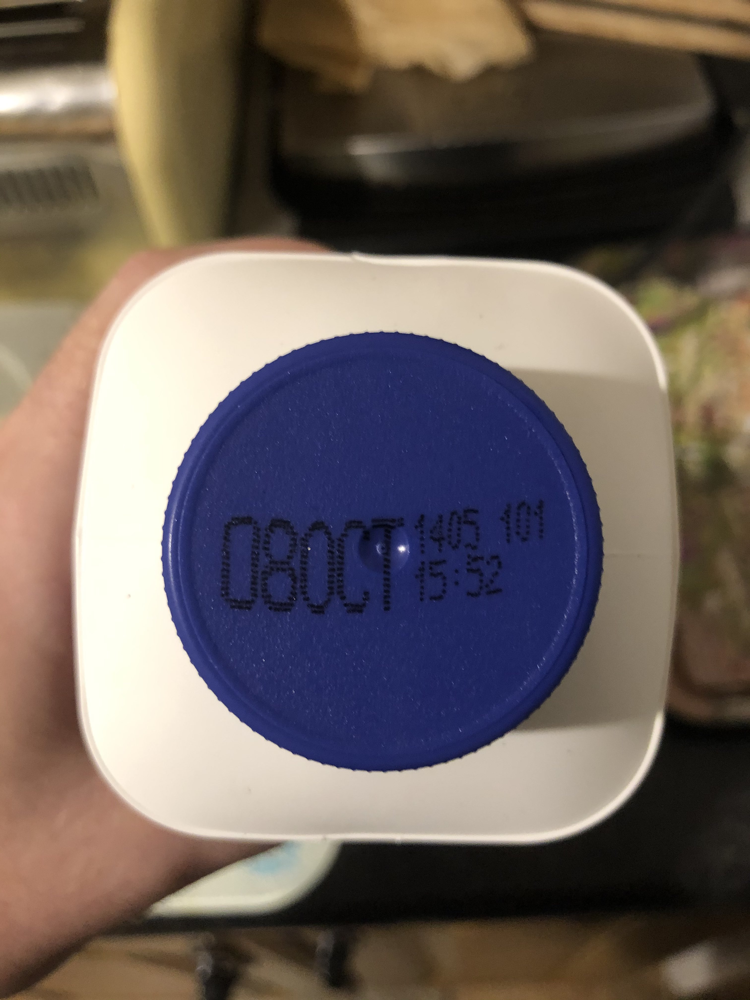
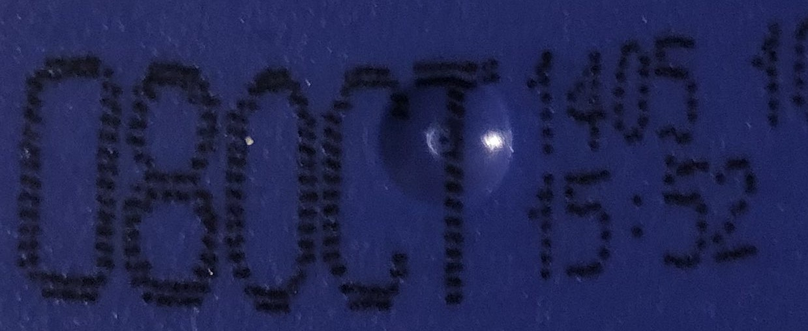

# sell-by-date-identifier
# Members 
|Names          |Student Numbers|Course |Blog Link|
| ------------- |:-------------:|:-----:|---------:|
| Daniel Simons | C17371946     | TU586 |https://danraysimons.wordpress.com/|
|Stephen Creighton| C17344841   | TU586 |https://c17344841mytudublin.wordpress.com/|

# Description
This program is made to allow a user to input an image containing a use by date somewhere within, it takes the image and locates and segments the use by date through Image processing processes. The output will be the located and cropped image of the use by date, this can be used later maybe in OCR software to detect the characters within the text with less issues.

More detailed analysis will be provided within the code

# Instructions
1. Run the cell/program
2. A popup window will appear with a notice to select an image, click ok
3. Select the image you wish to use which contains the mooju lids use by date
4. View the window that pops up for it's main output
5. Other outputs can be viewed at the bottom of the code

# Concepts
* Colorspaces
* Cropping
* Morpholgy
* Segmentation
* Contours
* Masking

# Example input and output
## Input image 

## Output image

